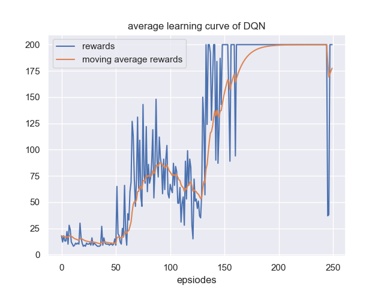

# DQN

## 原理简介
DQN是Q-leanning算法的优化和延伸，Q-leaning中使用有限的Q表存储值的信息，而DQN中则用神经网络替代Q表存储信息，这样更适用于高维的情况，相关知识基础可参考[datawhale李宏毅笔记-Q学习](https://datawhalechina.github.io/leedeeprl-notes/#/chapter6/chapter6)。

论文方面主要可以参考两篇，一篇就是2013年谷歌DeepMind团队的[Playing Atari with Deep Reinforcement Learning](https://www.cs.toronto.edu/~vmnih/docs/dqn.pdf)，一篇是也是他们团队后来在Nature杂志上发表的[Human-level control through deep reinforcement learning](https://web.stanford.edu/class/psych209/Readings/MnihEtAlHassibis15NatureControlDeepRL.pdf)。后者在算法层面增加target q-net，也可以叫做Nature DQN。

Nature DQN使用了两个Q网络，一个当前Q网络𝑄用来选择动作，更新模型参数，另一个目标Q网络𝑄′用于计算目标Q值。目标Q网络的网络参数不需要迭代更新，而是每隔一段时间从当前Q网络𝑄复制过来，即延时更新，这样可以减少目标Q值和当前的Q值相关性。

要注意的是，两个Q网络的结构是一模一样的。这样才可以复制网络参数。Nature DQN和[Playing Atari with Deep Reinforcement Learning](https://www.cs.toronto.edu/~vmnih/docs/dqn.pdf)相比，除了用一个新的相同结构的目标Q网络来计算目标Q值以外，其余部分基本是完全相同的。细节也可参考[强化学习（九）Deep Q-Learning进阶之Nature DQN](https://www.cnblogs.com/pinard/p/9756075.html)。

https://blog.csdn.net/JohnJim0/article/details/109557173)

## 伪代码


## 代码实战

### RL接口

首先是强化学习训练的基本接口，即通用的训练模式：
```python
for i_episode in range(MAX_EPISODES):
	state = env.reset() # reset环境状态
	for i_step in range(MAX_STEPS):
		 action = agent.choose_action(state) # 根据当前环境state选择action
         next_state, reward, done, _ = env.step(action) # 更新环境参数
         agent.memory.push(state, action, reward, next_state, done) # 将state等这些transition存入memory
         agent.update() # 每步更新网络
         state = next_state # 跳转到下一个状态
         if done:
         	break        
```
如上，首先需要循环多个episode训练，在每个episode中，首先需要重置环境，然后开始探索，每个episode加一个MAX_STEPS(也可以使用while not done, 加这个max_steps有时是因为比如gym环境训练目标就是在200个step下达到200的reward)，接下来的流程如下：
1. agent选择动作
2. 环境根据agent的动作反馈出新的state和reward
3. agent进行更新，如有memory就会将transition(包含state，reward，action等)存入memory中
4. 跳转到下一个状态
如果提前done了，就跳出for循环，进行下一个episode的训练。

### 两个Q网络
前面讲了Nature DQN中有两个Q网络，一个是policy_net，一个是延时更新的target_net，两个网络的结构是一模一样的，如下(见```model.py```)：
```python
import torch.nn as nn
import torch.nn.functional as F

class FCN(nn.Module):
    def __init__(self, state_dim=4, action_dim=18):
        """ 初始化q网络，为全连接网络
            state_dim: 输入的feature即环境的state数目
            action_dim: 输出的action总个数
        """
        super(FCN, self).__init__()
        self.fc1 = nn.Linear(state_dim, 128) # 输入层
        self.fc2 = nn.Linear(128, 128) # 隐藏层
        self.fc3 = nn.Linear(128, action_dim) # 输出层
        
    def forward(self, x):
        # 各层对应的激活函数
        x = F.relu(self.fc1(x)) 
        x = F.relu(self.fc2(x))
        return self.fc3(x)
```
输入为state，输出为action，注意根据state和action的维度调整隐藏层的层数，这里设为128

在```agent.py```中我们定义强化学习算法，包括```choose_action```和```update```两个主要函数，初始化中：
```python
self.policy_net = FCN(state_dim, action_dim).to(self.device)
self.target_net = FCN(state_dim, action_dim).to(self.device)
# target_net的初始模型参数完全复制policy_net
self.target_net.load_state_dict(self.policy_net.state_dict())
self.target_net.eval()  # 不启用 BatchNormalization 和 Dropout
# 可查parameters()与state_dict()的区别，前者require_grad=True
```
可以看到policy_net跟target_net结构和初始参数一样，但在更新的时候target是每隔一段episode更新的，如下(见```main.py```)：
```python
# 更新target network，复制DQN中的所有weights and biases
if i_episode % cfg.target_update == 0:
	agent.target_net.load_state_dict(agent.policy_net.state_dict())
```
可以调整```cfg.target_update```，注意该变量不要调得太大，否则会收敛很慢，我们最后保存的模型也是这个target_net，如下(见```agent.py```)：
```python
def save_model(self,path):
	torch.save(self.target_net.state_dict(), path)
```
### Replay Memory
然后就是Replay Memory了，如下(见```memory.py```)：
```python
import random
import numpy as np

class ReplayBuffer:
    
    def __init__(self, capacity):
        self.capacity = capacity
        self.buffer = []
        self.position = 0
    
    def push(self, state, action, reward, next_state, done):
        if len(self.buffer) < self.capacity:
            self.buffer.append(None)
        self.buffer[self.position] = (state, action, reward, next_state, done)
        self.position = (self.position + 1) % self.capacity
    
    def sample(self, batch_size):
        batch = random.sample(self.buffer, batch_size)
        state, action, reward, next_state, done =  zip(*batch)
        return state, action, reward, next_state, done
    
    def __len__(self):
        return len(self.buffer)
```
其实比较简单，主要包括push和sample两个步骤，push是将transitions放到memory中，sample是从memory随机抽取一些transition。

最后结果如下：



## 参考

[with torch.no_grad()](https://www.jianshu.com/p/1cea017f5d11)

